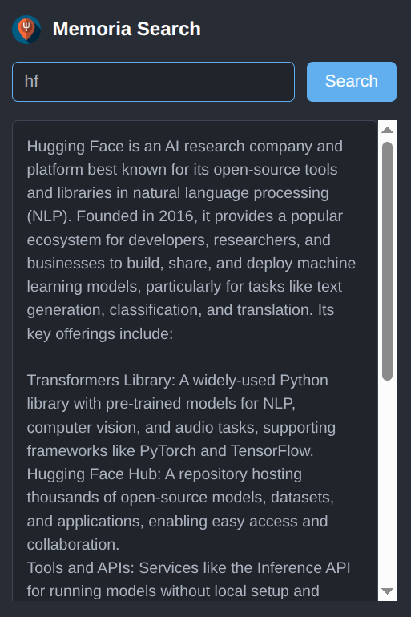
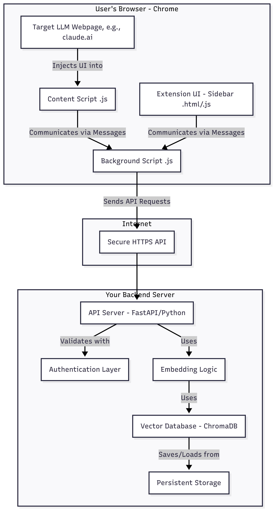

# Memoria 🧠

[](https://opensource.org/licenses/MIT)
[](https://www.python.org/downloads/)
[](https://fastapi.tiangolo.com/)

A browser extension that gives any LLM a persistent, long-term memory, solving the problem of stateless conversations and constant context repetition.

***

### The Problem

Large Language Models (LLMs) like ChatGPT, Grok, and Claude are incredibly powerful, but they have one major limitation: they are **stateless**. Every new chat session starts from a blank slate. You constantly have to re-explain project details, personal preferences, and past conversations, which is inefficient and frustrating.

### Solution

**Memoria** acts as an intelligent memory layer that works alongside any LLM. It allows you to explicitly save important pieces of information from a conversation to a permanent, AI-powered database.

Later, when you start a new conversation, you can instantly search your memories using natural language and inject the relevant context directly into your prompt.

<p align="center">
  
</p>


## Features

*   **Save to Memory:** A simple "Save" button is injected next to any AI response, allowing you to save crucial information with a single click.
*   **Semantic Search:** Search your memories based on *meaning* and *concept*, not just keywords. Searching for "startup marketing ideas" will find memories about "social media campaigns for new companies."
*   **Click-to-Paste:** Search results appear in a clean popup. Clicking any memory instantly pastes its content into the active chat box, ready to be used as context.
*   **Persistent & Synced:** All memories are stored in a secure cloud database, so your knowledge is available on any computer where you have the extension installed.
*   **Multi-Platform Support:** Works seamlessly across multiple LLM sites. Currently supports:
    *   Grok (`grok.com`)
    *   Google AI Studio (`aistudio.google.com`)

## Tech Stack

The project is a full-stack application composed of a browser extension front-end and a Python backend.

**Frontend (Chrome Extension):**
*   **Manifest V3:** The modern, secure standard for Chrome Extensions.
*   **JavaScript:** Vanilla JS for content scripts, background service workers, and popup logic.
*   **HTML/CSS:** For the popup search interface.
*   **Chrome APIs:** `chrome.runtime.sendMessage`, `chrome.tabs.query`, etc.

**Backend (API Server):**
*   **Python 3.11**
*   **FastAPI:** For building a high-performance, modern API.
*   **Gunicorn & Uvicorn:** For running the application in a production environment.
*   **Sentence-Transformers:** For generating vector embeddings from text (using the `paraphrase-albert-small-v2` model for efficiency).
*   **Pinecone:** A managed, persistent vector database for storing and searching memories.
*   **Docker:** For containerizing the application for reliable deployment.

##  Architecture
Memoria uses a standard client-server architecture:
<p align="center">
  
</p>


1.  The **Chrome Extension** (Client) runs in the user's browser, injecting UI elements and capturing user actions.
2.  The **FastAPI Server** (Backend), deployed on Hugging Face Spaces, handles all the heavy lifting.
3.  The **Pinecone Database** acts as our permanent, intelligent memory store.


##  Setup

### Installation (for End Users)

### Local Development Setup (for Developers)

To run this project on your local machine, follow these steps.

**Prerequisites:**
*   Python 3.10+
*   Google Chrome

**1. Clone the Repository:**
```bash
git clone https://github.com/rohitkshirsagar19/memoria.git
cd memoria-project
```

**2. Set Up the Backend:**
*   Navigate to the backend directory:
    ```bash
    cd backend
    ```
*   Create and activate a Python virtual environment:
    ```bash
    python3 -m venv venv
    source venv/bin/activate  # On Windows: venv\Scripts\activate
    ```
*   Install the required packages:
    ```bash
    pip install -r requirements.txt
    ```
*   **Important:** Create a `.env` file in the `backend` directory and add your Pinecone API key:
    ```
    PINECONE_API_KEY="YOUR_API_KEY_HERE"
    ```
*   Run the server:
    ```bash
    python main.py
    ```
    The backend will now be running on `http://127.0.0.1:8000`.

**3. Set Up the Frontend:**
*   Open Google Chrome and navigate to `chrome://extensions`.
*   Enable **"Developer mode"** in the top right corner.
*   Click **"Load unpacked"**.
*   Select the `memoria-project/extension` folder from your local files.
*   The Memoria extension will now be installed and ready for local testing. It will be configured to communicate with your local backend server.

## Roadmap & Future Work

*   [ ] **Support More LLMs:** Add configurations for Claude, Perplexity, and others.
*   [ ] **Memory Management UI:** Create a dedicated page where users can view, edit, and delete their saved memories.
*   [ ] **User Accounts:** Implement user authentication to replace the need for separate API keys.
*   [ ] **Categorization:** Allow users to tag or categorize memories for better organization.
*   [ ] **Publish to Firefox:** Port the extension to the Firefox Add-on Store.

## License

This project is licensed under the MIT License. See the [LICENSE](LICENSE.md) file for details.
